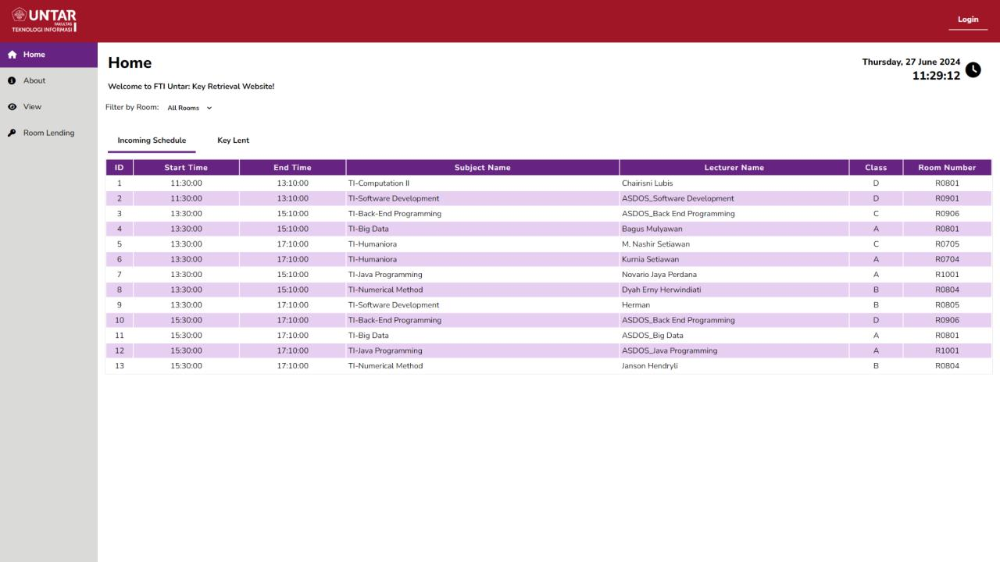
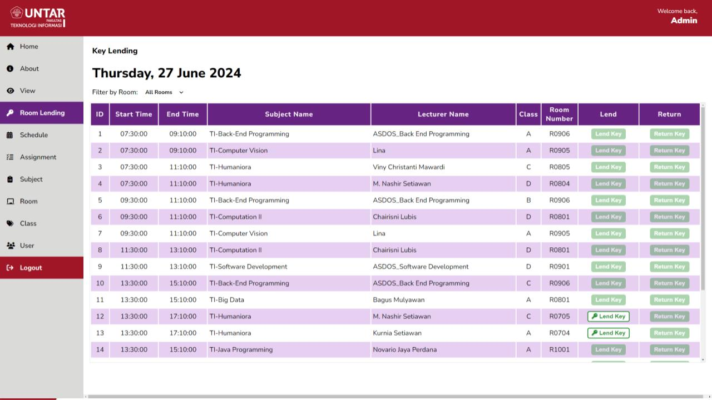
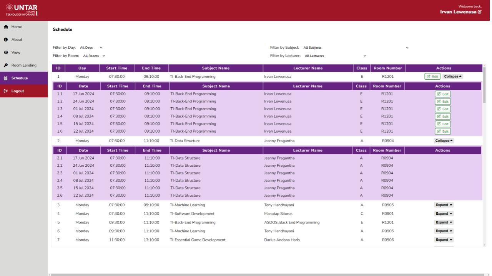

# <p align="center">Pengembangan Sistem Pengelolaan Ruang di FTI Untar</p>

## Tentang Proyek

Repositori ini merupakan hasil dari Project Website dengan topik "Pengembangan Sistem Pengelolaan Ruang di FTI Untar". Project ini dibuat untuk memenuhi salah satu komponen nilai UAS mata kuliah Back-End Programming dengan dosen pengampu Bapak Irvan Lewenusa, S.Kom., M.Kom.

Project ini dikerjakan secara kolaboratif oleh sekelompok mahasiswa dari program studi Teknik Informatika, kelas E di mata kuliah Back-End Programming, namun kelas A untuk angkatan 2022 di FTI Untar.

Kelompok 4

| NAMA                | NIM       | Username GitHub    |
|---------------------|-----------|--------------------|
| Jason Permana       | 535220002 | Dzeisonov          |
| Arya Wira Kristanto | 535220004 | Awk2824            |
| Nicholas Martin     | 535220027 | Nicholas-Martin007 |
| Kevin Jonathan JM   | 535220038 | kvnidn             |

## Teknologi yang Digunakan

- **Bahasa Pemrograman:** PHP
- **Framework:** Laravel
- **Template Engine:** Blade
- **Database:** PostgreSQL

## Panduan Instalasi
1. Untuk menggunakan bahasa pemrograman PHP, unduh installer PHP dari [php.net](https://www.php.net/downloads.php) dan lakukan instalasi.
2. Instal Composer dengan mengunduh installer dari [getcomposer.org](https://getcomposer.org/).
3. Untuk mengakses database, unduh dan instal PostgreSQL melalui link [postgresql.org](https://www.postgresql.org/download/).
4. Lakukan instalasi Node.js untuk mengelola paket JavaScript melalui link [nodejs.org](https://nodejs.org/).
5. Instal PgAdmin melalui [pgadmin.org](https://www.pgadmin.org/download/) untuk mengelola dan memantau database PostgreSQL.
6. Unduh dan instal XAMPP melalui [apachefriends.org](https://www.apachefriends.org/download.html) untuk pengembangan dan pengujian website pada server lokal.

## Panduan Menjalankan Website*
1. Masuk ke direktori proyek
2. Clone repository github dengan menjalankan perintah ```git clone https://github.com/kvnidn/backend-uas.git```
3. Lanjutkan dengan menginstall composer dengan menjalankan perintah ```composer install```
4. Lakukan optimalisasi dengan menjalankan perintah ```php artisan optimize:clear```
5. Untuk mendapatkan key dari APP_KEY di file .env, jalankan perintah ```php artisan key:generate```
6. Buat tabel-tabel di database sesuai dengan skema yang telah ditentukan dengan menjalankan perintah ```php artisan migrate```
7. Masukkan data awal yang telah dibuat untuk menjalankan website dengan perintah ```php artisan db:seed```
8. Terakhir, jalankan aplikasi pada server lokal dengan mengetikkan perintah ```php artisan serve```
9. Website akan berjalan pada port 8000  
*Catatan: Semua perintah dijalankan pada command window

## Contoh Tampilan Website:




Masuk dengan akun admin dengan memasukkan  
Username: admin@example.com  
Password: 12345  
pada pop up login
